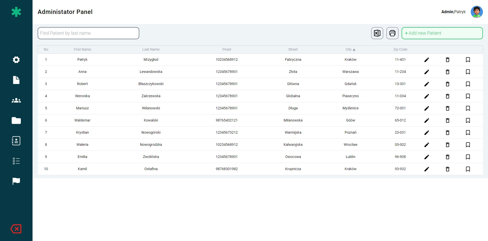

# Clinic Patient Dashboard

Welcome to the Clinic Patient Dashboard, an advanced and efficient application for managing patient records in clinical settings. This application is designed to empower healthcare professionals with comprehensive control over patient information, streamlining operations such as adding, editing, deleting, and efficiently searching for patients by surname. It also features robust sorting capabilities, ensuring that patient management is both intuitive and efficient. By leveraging MySQL for database operations, the Clinic Patient Dashboard ensures reliability and performance at the core of patient data handling.

## Technologies

[](https://reactjs.org/)
[](https://redux-toolkit.js.org/)
[](https://tailwindcss.com/)
[](https://expressjs.com/)
[](https://www.mysql.com/)

## How to run local app

### Prerequisites

- Make sure you have Node.js installed on your system [node](https://nodejs.org/).
- Make sure you have MySQL installed on your system [SQL](https://dev.mysql.com/downloads/mysql/).

### Installation Steps

1. Install npm packages:

   ```sh
   npm install
   ```

2. Create a MySQL database and set up the schema and seed data
   code to create database and values to database is in patients.sql file
3. Configure the database connection:

   - Navigate to the `server` folder.
   - Create a `.env` file in the `server` directory.
   - Add the following content to the `.env` file, replacing the placeholders with your actual MySQL credentials:

     ```sh
     DB_HOST=localhost
     DB_USER=root
     DB_PASSWORD=your_mysql_root_password
     DB_NAME=clinic_db
     ```

   - Make sure the MySQL service is running and the credentials match the user and password of your MySQL database.

4. Start the server:

   ```sh
   cd server
   node index.js
   ```

5. Start the client

   ```sh
   npm run dev
   ```

### View Case

   
